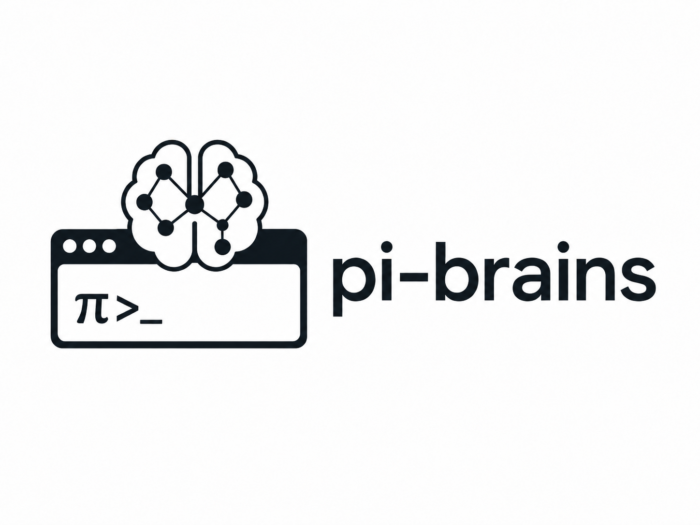

<p align="center">
  
</p>

<h3 align="center">
  Teach Pi what to remember and how to behave.
</h3>

pi-brains lets you teach [Pi](https://github.com/earendil-works/pi) by chatting with it.

Tell Pi what to remember, how to behave, or what to check before it acts. pi-brains turns that into durable knowledge tied to the right files, topics, events, or preferences.

GitSense powers the knowledge and behavior layer. pi-brains brings it into Pi so Pi can search what is already known, apply the right guidance, and verify against source before it acts.

## Install

```bash
pi install npm:@gitsense/pi-brains
```

Start Pi in a workspace and run:

```text
/brains
```

If GitSense (`gsc`) is not installed, `/brains` will show install instructions.

## Why Pi + Brains

pi-brains gives Pi a knowledge and behavior layer organized by files, topics, events, and preferences.

### How pi-brains Is Different

pi-brains is not trying to replace hooks, markdown instructions, or search.

Hooks are useful for reacting to events. Markdown is useful for shared guidance. Search is useful for finding text.

pi-brains gives Pi focused records it can query and apply while it works. A record can be personal, project-wide, file-specific, topic-specific, or event-triggered. That means Pi can pull in the right rule, note, lesson, or Brain result when the task calls for it, before it commits to the wrong path or spends context on the wrong files.

### What Pi Can Do

Pi can:

- follow your personal preferences across sessions
- apply project conventions without you repeating them
- check notes before interpreting unfamiliar files
- remember lessons from previous work
- use repository intelligence before choosing files to inspect
- run triggers when an action needs a guardrail

The point is not that Pi stops reading code. The point is that Pi gets a better starting point, then verifies the important findings against source.

## Teach Pi in Plain Language

You teach Pi by telling it what you want in plain language. pi-brains handles turning that into durable behavior or knowledge.

Here are a few examples of prompts that can become durable behavior or reusable knowledge:

### Catch Habit Commands

Teach Pi to recognize accidental terminal habits before they become chat messages.

```text
I often type ls, clear, and pwd out of habit. Add a personal rule so those prompts are treated as terminal habits and are not sent into the conversation.
```

### Ask Before Editing

Make approval part of Pi's default behavior instead of repeating it every session.

```text
Add a personal rule: do not write or edit files until I explicitly say to make the change. You can inspect files and propose a plan first.
```

### Explain A File Format

Teach Pi project context before it reads unfamiliar files.

```text
Add a repo note for data/accounting/*.ledger. These files use the format date | type | amount | account | reference. Before interpreting these files, use the note to explain the ledger format and business meaning.
```

## Try It Yourself

These repos are already set up so you can see how pi-brains works.

### Rules Demo

Use this repo to try rules, notes, lessons, and triggers.

#### What You'll Learn

- rules can change how Pi behaves before it acts
- notes can teach Pi project-specific context, such as how to read ledger files
- lessons can carry previous work into future sessions
- triggers can warn, block, or run checks around tool actions

```bash
git clone https://github.com/gitsense/gsc-rules-demos.git
cd gsc-rules-demos
pi install npm:@gitsense/pi-brains
pi
```

If this is your first time using `pi-brains`, run:

```text
/brains
```

Then ask Pi:

```text
Show me what pi-brains can do in this repo.
```

### Knowledge Demo

Use the GitSense Pi fork to try repository intelligence for Pi itself.

#### Repository Intelligence

Brains make structured knowledge available to Pi before it starts opening files. Instead of starting with blind grep and file loading, Pi can ask what is already known first.

Pi can combine different kinds of knowledge:

| Brain | What Pi learns before spending context |
| --- | --- |
| Docs | Which guide, section, or reference doc to read |
| Code intent | Which files likely matter and why |
| Dependency maps | Which files have high blast radius |
| Implicit todos | Hidden debt, stubs, workarounds, or cleanup candidates |
| Rules | What behavior must be followed |
| Lessons | What previous work taught the team |

```bash
git clone https://github.com/gitsense/pi.git
cd pi
pi install npm:@gitsense/pi-brains
pi
```

Build the included Brains:

```text
/brains build
```

Pi can then use its own docs, code intent, dependency map, and implicit todos before it starts opening files.

Ask Pi:

```text
I want to build a Pi extension. Before reading code, use the brains in this repo to find the docs, APIs, gotchas, and examples I should know about.
```

Then Pi can verify the important findings against source before it acts.

For example, a broad request like this:

```text
I want to improve search. Before deciding what to change, use the brains in this repo to identify any gotchas, then verify the important findings against source.
```

can become a focused plan:

- "Search" may mean TUI fuzzy matching, autocomplete, session search, model filtering, or agent grep/find tools.
- `packages/tui/src/fuzzy.ts` may be shared infrastructure with high blast radius.
- Agent `grep.ts` and `find.ts` may be separate from TUI search.
- A Brain may surface hidden maintenance work, such as an incomplete stub or deprecated compatibility path.
- Pi can verify the relevant findings against source before proposing a plan.

Grep finds text. Vector search finds similar passages. Brains give Pi structured, queryable knowledge it can use to decide where to spend context.

## Commands

| Command | Description |
| --- | --- |
| `/brains` | Initialize GitSense context and show the HUD |
| `/brains build` | Build/import all local Brain manifests |
| `/brains build <brain-name>` | Build/import one Brain manifest |
| `/brains insights` | Show session status and brain data |
| `/brains rules` | Show rule status and options |
| `/brains rules on` | Enable rules checking |
| `/brains rules off` | Disable rules checking |
| `/brains rules status` | Show recent rule decisions |
| `/brains about` | Show what GitSense can do |
| `/brains debug` | Toggle debug logging |
| `/brains help` | Show available commands |

## Current Boundaries

- File tracking is exact for structured `read`, `edit`, and `write` tools.
- Arbitrary shell file activity may be missing.
- Brain analysis and cross-session history require GitSense integration.
- Brains are guidance, not a replacement for source verification.

## Development

```bash
npm run check
npm test
```

## License

MIT
