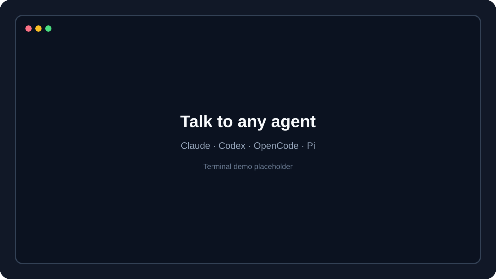
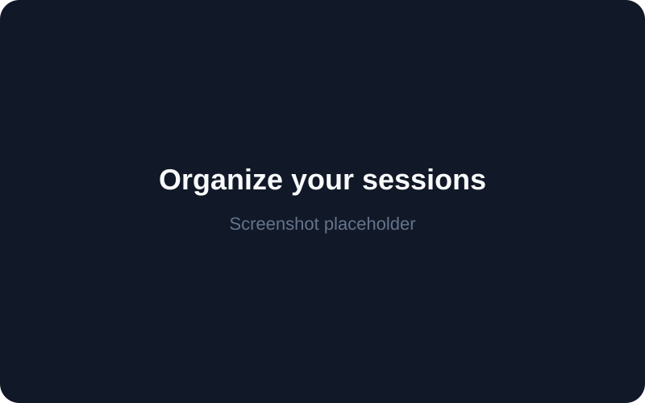
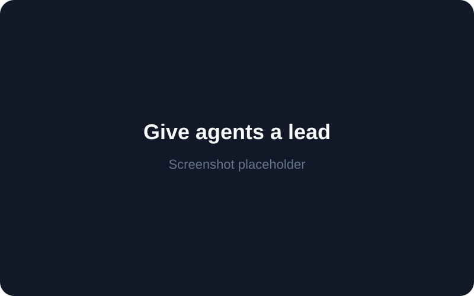
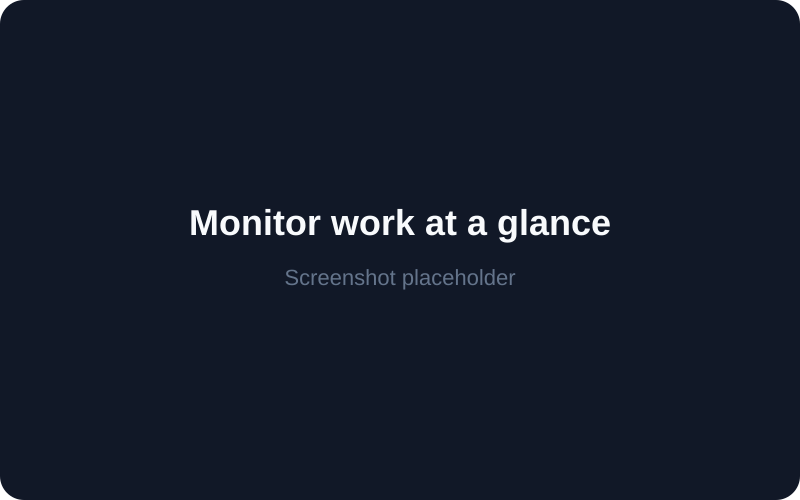
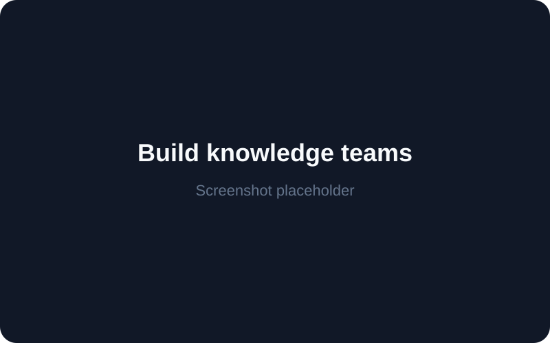
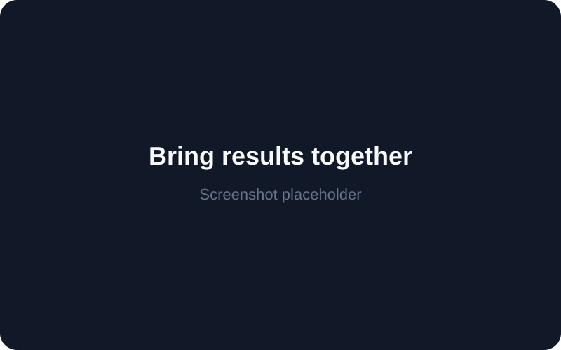
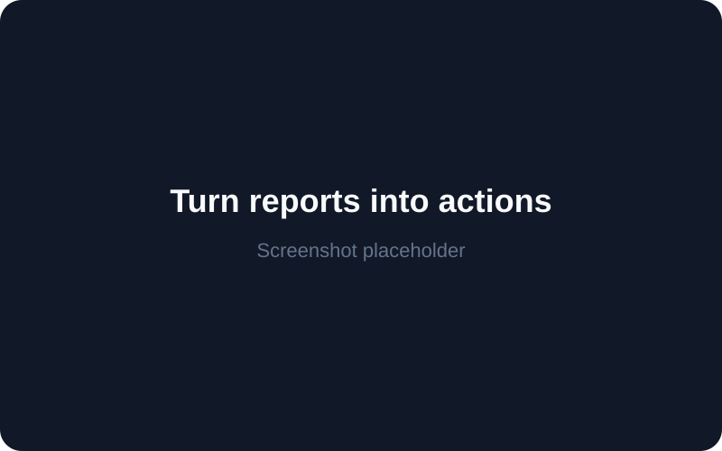

<p align="center">
  
</p>

<h3 align="center">
  Give Pi the ability to remember and work with other agents.
</h3>

<p align="center">
  <a href="#install">Install</a> &nbsp;·&nbsp;
  <a href="#talk-to-any-agent">Talk to any agent</a> &nbsp;·&nbsp;
  <a href="#scale-with-gitsense-chat">Scale with GitSense Chat</a> &nbsp;·&nbsp;
  <a href="#teach-pi-what-to-remember-and-how-to-behave">Teach Pi</a> &nbsp;·&nbsp;
  <a href="#try-it-yourself">Try it yourself</a>
</p>

**pi-brains** gives [Pi](https://github.com/earendil-works/pi) durable knowledge
and rules it can apply while it works. It also gives every Pi session an inbox,
allowing agents to ask questions, share context, and delegate work across
conversations.

## Install

```bash
pi install npm:@gitsense/pi-brains
```

Start Pi in a workspace and run:

```text
/brains
```

If [GitSense (`gsc`)](https://github.com/gitsense/gsc-cli) is not installed, `/brains` will show install instructions.

## Talk to any agent

Ask a Pi session a question, send it useful context, or delegate work from
Claude, Codex, OpenCode, or another agent. The response returns to the agent
you are already using, without switching sessions or copying context.

<p align="center">
  
</p>

Run `/brains me` in the Pi session to copy its address. Its inbox can receive
questions, context, and delegated tasks from other agents. Enable
`/brains inbox auto on` when you want new messages delivered automatically.

## Scale with GitSense Chat

Pi Brains helps agents remember and work together. GitSense Chat gives you one
place to organize, monitor, and coordinate them at scale.

<table width="100%">
  <tr>
    <td width="50%" valign="top">
      <p align="center"><strong>Organize your sessions</strong></p>
      <p align="center"></p>
    </td>
    <td width="50%" valign="top">
      <p align="center"><strong>Give agents a lead</strong></p>
      <p align="center"></p>
    </td>
  </tr>
  <tr>
    <td width="50%" valign="top">
      <p align="center"><strong>Monitor work at a glance</strong></p>
      <p align="center"></p>
    </td>
    <td width="50%" valign="top">
      <p align="center"><strong>Build knowledge teams</strong></p>
      <p align="center"></p>
    </td>
  </tr>
  <tr>
    <td width="50%" valign="top">
      <p align="center"><strong>Bring results together</strong></p>
      <p align="center"></p>
    </td>
    <td width="50%" valign="top">
      <p align="center"><strong>Turn reports into actions</strong></p>
      <p align="center"></p>
    </td>
  </tr>
</table>

GitSense Chat can use Pi Brains heartbeats to show which sessions are running,
stopped, or ready to receive work. This makes it possible to monitor dozens of
sessions without opening every terminal.

<p align="center">
  <strong><a href="https://github.com/gitsense/chat">See what GitSense Chat makes possible →</a></strong>
</p>

## Teach Pi what to remember and how to behave

1. **You teach** - Tell Pi what your domain knows, what rules to follow, what mistakes to avoid, or what context to pull in.
2. **It remembers** - pi-brains saves that guidance as focused GitSense records at the personal, repo, file, or topic level.
3. **It applies** - Pi queries those records when they matter: before it starts, before it edits, after it uses a tool, or when a session ends.
4. **Agents collaborate** - Pi can delegate work to any existing session and bring its response back.

### What makes it different

pi-brains is not trying to replace hooks, markdown instructions, or search.

Hooks react to events. Markdown shares guidance. Search finds text.

pi-brains gives Pi focused records it can query and apply while it works. It
also makes existing Pi sessions addressable as workers.

| Approach | Best at | Limitation |
| --- | --- | --- |
| Hooks | Reacting to workflow events | Hard to teach, browse, and query as durable knowledge |
| Markdown docs | Sharing human-readable guidance | Passive unless Pi knows when and where to read them |
| Search | Finding matching text or similar passages | Returns matches, not scoped behavioral records |
| Subagents | Delegating work in the current workflow | The worker is usually created for the current task |
| pi-brains | Storing scoped guidance and delegating to existing Pi sessions | Complements source, docs, and newly created subagents |

The result is not that Pi stops reading source. Pi gets a better starting point,
verifies important findings before acting, and can ask a session that already
has relevant context to help.

### What rules can do

Rules can do more than sit in a doc. They can catch accidental terminal habits, stop risky edits until Pi reads the right context, ask Pi to verify a result, or leave guidance for the next turn.

## Configure Rules

Pi Brains includes an opt-in [rule catalog](rules/README.md). Package
installation does not activate these policies automatically. Users can review
each bundle and import it into either personal scope for cross-repository
behavior or repository scope for project-shared behavior.

The first included pack guides supported shell discovery commands through
`gsc bash`, producing structured evidence that can be correlated with the Pi
session. It offers advisory and strict modes. See the
[observable shell discovery instructions](rules/gsc-bash-observability/README.md)
for review, installation, switching, and removal commands.

Start the interactive configuration from Pi:

```text
/brains rules shell
```

## Try It Yourself

These repos are already set up so you can see how pi-brains works.

### Rules Demo - [`gsc-rules-demos`](https://github.com/gitsense/gsc-rules-demos)

Use this repo to see how project knowledge and agent behavior can ship with code.

```bash
git clone https://github.com/gitsense/gsc-rules-demos.git
cd gsc-rules-demos
pi install npm:@gitsense/pi-brains
pi
```

Then run `/brains` and ask Pi:

```text
/brains
What rules are shipped with this repository?
```

Pi will walk you through the demo rules, notes, lessons, and triggers included in the repo.

- **Quick examples to try:** See the [gsc-rules-demos README](https://github.com/gitsense/gsc-rules-demos#try-the-examples) for prompts you can copy and paste.
- **Detailed walkthrough:** See the [Pi Hands-On Guide](https://github.com/gitsense/gsc-rules-demos/blob/main/docs/pi/hands-on.md) for setup notes and expected behavior.

**What you'll learn:** rules can change how Pi behaves before it acts, notes can teach project-specific context, lessons can carry previous work into future sessions, and triggers can warn, block, or run checks around tool actions.

### Knowledge Demo - [`gitsense/pi`](https://github.com/gitsense/pi)

Use the GitSense Pi fork to try repository intelligence for Pi itself.

```bash
git clone https://github.com/gitsense/pi.git
cd pi
pi install npm:@gitsense/pi-brains
pi
```

Build the included Brains:

```text
/brains build
```

Then ask Pi to use those Brains before it plans a change:

```text
I want to build a Pi extension. Before reading code, use the brains in this repo to find the docs, APIs, gotchas, and examples I should know about.
```

**What you'll learn:** Brains index repository knowledge so Pi can ask what is already known before spending context on source files.

| Brain | What Pi learns before opening files |
| --- | --- |
| Docs | Which guide, section, or reference doc to read |
| Code intent | Which files likely matter and why |
| Dependency maps | Which files have high blast radius |
| Implicit todos | Hidden debt, stubs, workarounds, or cleanup candidates |
| Rules | What behavior must be followed |
| Lessons | What previous work taught the team |

For example, a broad request like this:

```text
I want to improve search. Before deciding what to change, use the brains in this repo to identify any gotchas, then verify the important findings against source.
```

can become a focused plan:

- "Search" may mean TUI fuzzy matching, autocomplete, session search, model filtering, or agent grep/find tools.
- `packages/tui/src/fuzzy.ts` may be shared infrastructure with high blast radius.
- Agent `grep.ts` and `find.ts` may be separate from TUI search.
- A Brain may surface hidden maintenance work, such as an incomplete stub or deprecated compatibility path.
- Pi can verify the relevant findings against source before proposing a plan.

Grep finds text. Vector search finds similar passages. Brains give Pi structured, queryable knowledge it can use to decide where to spend context.

## Essential commands

| Command | Description |
| --- | --- |
| `/brains` | Initialize Pi Brains |
| `/brains rules` | Teach Pi what to remember and how to behave |
| `/brains me` | Show and copy the current agent's address |
| `/brains inbox` | Review messages from people and other agents |
| `/brains inbox auto on` | Deliver new messages to this session automatically |
| `/brains checkpoint` | Create a review point before continuing |

Run `/brains help` inside Pi to discover additional commands.

<details>
<summary>Additional command reference and snapshot details</summary>

### Full command reference

| Command | Description |
| --- | --- |
| `/brains` | Initialize GitSense expert context |
| `/brains build` | Build/import all local Brain manifests from `.gitsense/manifests` |
| `/brains build <brain-name>` | Build/import one local Brain manifest |
| `/brains build <manifest-path-or-url>` | Build/import a Brain from a path or URL |
| `/brains build --force` | Rebuild Brain manifests even if cached data exists |
| `/brains build help` | Show Brain build help and current Brain status |
| `/brains insights` | Show a static inspect snapshot |
| `/brains rules` | Show rule status and options |
| `/brains rules on` | Enable rules checking |
| `/brains rules off` | Disable rules checking |
| `/brains rules status` | Show recent rule decisions |
| `/brains rules shell` | Configure observable shell discovery rules |
| `/brains rules shell status` | Show personal and repository shell-rule modes |
| `/brains about` | Show what GitSense can do |
| `/brains debug` | Toggle debug logging |
| `/brains debug on` | Enable debug logging |
| `/brains debug off` | Disable debug logging |
| `/brains debug file` | Show the debug log file path |
| `/brains checkpoint` | Create a review checkpoint |
| `/brains checkpoint suggest on` | Enable checkpoint suggestions |
| `/brains checkpoint suggest off` | Disable checkpoint suggestions |
| `/brains checkpoint suggest status` | Show checkpoint suggestion status |
| `/brains snapshots` | Show snapshot status for the current session |
| `/brains snapshots list` | List each stage's directory, manifest, Git object database, and commit |
| `/brains snapshots create` | Capture the exact recognized file contents at the current session leaf |
| `/brains snapshots clear` | Move the current session's snapshots to a recoverable archive |
| `/brains forget` | Prune entries after the current `/tree` position (with backup) |
| `/brains summary` | Generate a session summary as the final message |
| `/brains inspect` | Show inspect view instructions |
| `/brains sessions` | Open the GitSense Chat view for all Pi sessions |
| `/brains search` | Open GitSense Chat search across Pi sessions |
| `/brains me` | Show and copy this agent's session ID, process ID, and inbox auto-accept status |
| `/brains inbox` | Review pending messages in the session inbox |
| `/brains inbox list` | List all messages in the session inbox |
| `/brains inbox info` | Show the mailbox address, message summary, and wait-group progress |
| `/brains inbox clear` | Dismiss rejected outbound sends |
| `/brains inbox code generate` | Generate a 90-day Chat inbox code and enable Chat sending |
| `/brains inbox code delete` | Revoke the Chat inbox code and disable Chat sending |
| `/brains inbox code status` | Show the current Chat inbox code status |
| `/brains inbox status` | Show the current auto-accept setting |
| `/brains inbox auto` | Show or configure automatic inbox acceptance |
| `/brains inbox auto on` | Automatically accept new inbox messages for this session |
| `/brains inbox auto off` | Disable automatic inbox acceptance |
| `/brains inbox auto status` | Show automatic inbox acceptance status |
| `/brains inbox help` | Show inbox commands and current settings |
| `/brains dismiss` | Dismiss the GitSense unavailable notice |
| `/brains help` | Show available commands |

### Session snapshots

Session snapshots preserve the exact contents of files recognized from session
activity, including files outside a Git repository. Run `/brains snapshots
create` before a broad change or after a verified milestone. If the recognized
file tree has not changed, GitSense reuses the latest stage instead of creating
a duplicate. Run `/brains snapshots list` to see the filesystem location of
every stage and manifest, plus the shared Git object database and commit IDs.

Snapshots may include recognized files outside the working repository. Common
credential paths and `.env`/private-key files are excluded. The defaults also
exclude files over 64 MiB and cap each stage at 256 MiB. `clear` asks for
confirmation and moves data under `GSC_HOME/data/pi/snapshot-trash` rather than
deleting it immediately.

</details>

## Session liveness

While a Pi session runs with pi-brains loaded (TUI mode), the extension
records a heartbeat every 10 seconds in a single shared SQLite store so
GitSense Chat can tell whether a session is alive or needs to be launched:

```text
GSC_HOME/data/pi/pi-heartbeats.sqlite3
```

One row per session in the `heartbeats` table: `session_id` (primary key),
`pid`, `cwd`, `started_at`, `status` (`alive` | `stopped`), and
`last_heartbeat_at` (epoch milliseconds), `runtime` (`tmux` | `terminal`),
and `auto_accept` (whether human-originated Chat mail will be injected),
indexed on
`(status, last_heartbeat_at)`. Writes are upserts with WAL + a busy timeout
so concurrent Pi sessions share the store safely; rows idle for more than 30
days are pruned on each write. On a clean shutdown the extension marks the
row `stopped`; on a crash the row simply goes stale. Consumers should treat a
session as alive when `status = 'alive'` and `last_heartbeat_at` is fresh,
and as needing launch when the row is missing, `stopped`, or stale. The
runtime is informational: a detached tmux-hosted Pi process remains alive and
messageable. A fresh session with `auto_accept = 0` is running but will not
automatically receive human-originated Chat messages; changing the setting
refreshes the heartbeat immediately. The extension exports
`getAliveHeartbeatSessionIds(dbPath, withinMs)` and
`getHeartbeatRecordsForSessions(dbPath, sessionIds)` for the two lookup
patterns (recently-alive set, and cross-reference against a session set).

## Current Boundaries

- File tracking is exact for structured `read`, `edit`, and `write` tools.
- Arbitrary shell file activity may be missing.
- Brain analysis and cross-session history require GitSense integration.
- Brains are guidance, not a replacement for source verification.
- Liveness is advertised by the extension heartbeat store; a Pi session without pi-brains loaded writes no heartbeat.

## Development

```bash
npm install
npm run check
npm test

# Regenerate portable observable-shell rule bundles after editing their triggers
npm run rules:build
```

To try local changes in Pi, install this package from your checkout:

```bash
pi install /path/to/pi-brains
pi
```

Then run:

```text
/brains
```

## License

MIT
