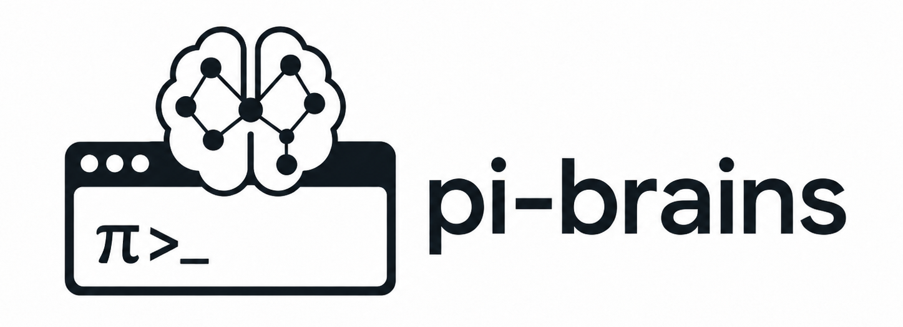
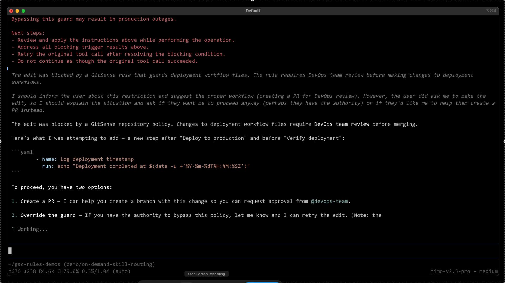
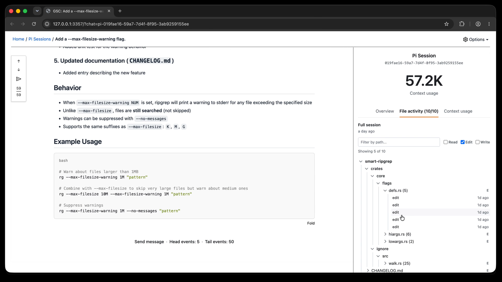
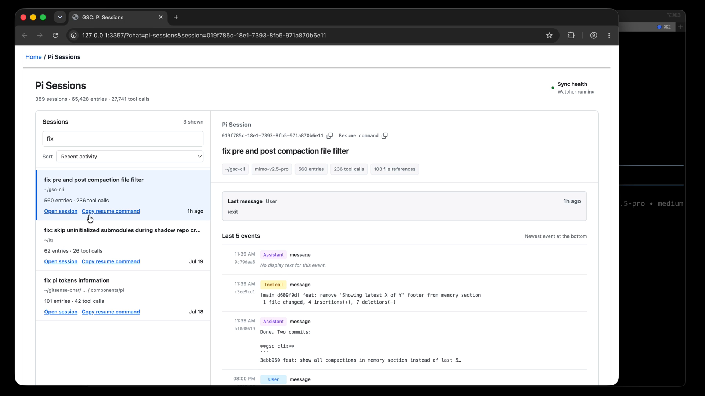
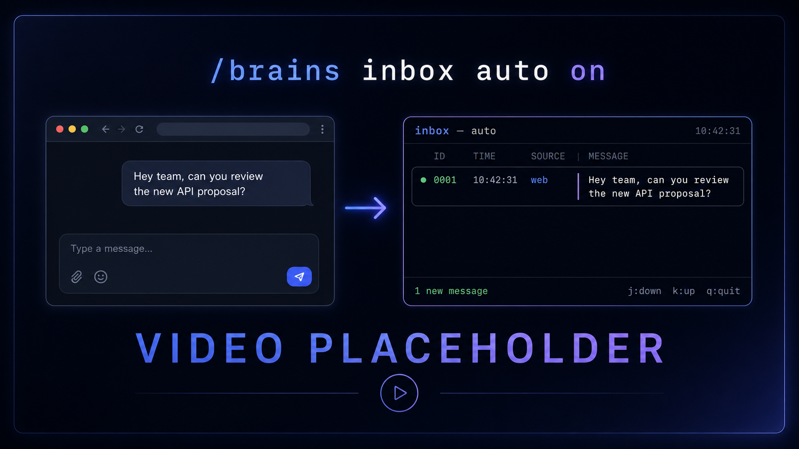
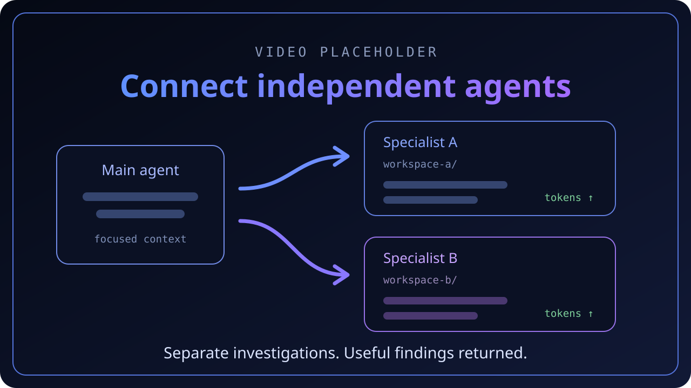

<p align="center">
  
</p>

<h3 align="center">
  Teach Pi what to remember and how to behave.
</h3>

<p align="center">
  <a href="#install">Install</a> &nbsp;·&nbsp;
  <a href="#see-it-in-action">See it in action</a> &nbsp;·&nbsp;
  <a href="#spread-knowledge-improve-reasoning">Multiple agents</a> &nbsp;·&nbsp;
  <a href="#how-it-works">How it works</a> &nbsp;·&nbsp;
  <a href="#configure-rules">Configure rules</a> &nbsp;·&nbsp;
  <a href="#try-it-yourself">Try it yourself</a>
</p>

**pi-brains** gives [Pi](https://github.com/earendil-works/pi) persistent, queryable guidance it can use while it works.

Tell Pi what your domain knows, what rules to follow, what mistakes to avoid, or what context to pull in. pi-brains saves that guidance as durable GitSense records, then helps Pi query, apply, and verify it at the right moment.

## Install

```bash
pi install npm:@gitsense/pi-brains
```

Start Pi in a workspace and run:

```text
/brains
```

If [GitSense (`gsc`)](https://github.com/gitsense/gsc-cli) is not installed, `/brains` will show install instructions.

## See it in action

<table width="100%">
  <tr>
    <td width="50%" valign="top">
      <p align="center"><code>/brains rules on</code></p>
      <p align="center">
        <a href="https://raw.githubusercontent.com/gitsense/pi-brains/staging/assets/demo/brains-rules-on.mp4">
          
        </a>
      </p>
      <p>Turn on guardrails that stop risky edits and enforce project behavior.</p>
    </td>
    <td width="50%" valign="top">
      <p align="center"><code>/brains inspect</code></p>
      <p align="center">
        <a href="https://raw.githubusercontent.com/gitsense/pi-brains/staging/assets/demo/brains-inspect.mp4">
          
        </a>
      </p>
      <p>Open the current session, add other agents from <strong>All Sessions</strong>, and collaborate with them.</p>
    </td>
  </tr>
  <tr>
    <td width="50%" valign="top">
      <p align="center"><code>/brains sessions</code></p>
      <p align="center">
        <a href="https://raw.githubusercontent.com/gitsense/pi-brains/staging/assets/demo/brains-sessions.mp4">
          
        </a>
      </p>
      <p>Filter all Pi sessions and bring the agents you need into one collaboration page.</p>
    </td>
    <td width="50%" valign="top">
      <p align="center"><code>/brains inbox auto on</code></p>
      <p align="center">
        
      </p>
      <p>Automatically deliver new inbox messages from GitSense Chat to the TUI.</p>
    </td>
  </tr>
</table>

## Spread knowledge. Improve reasoning.

Agent sessions learn a lot, then we usually discard them. Reusing what they
know means finding the session, asking a question, copying the response, and
pasting it into another chat. That friction often makes starting over feel
easier.

Pi Brains removes the handoff. Your current agent can talk to agents that
already know their workspaces and bring the answers back itself. Their context
may be a little out of date, but they can refresh quickly and help the current
agent get up to speed without starting from zero.

For example, give the main agent one simple instruction:

> Ask the other two agents to each create and run a script that counts files in
> their working directory by extension. When both agents reply, combine their
> results into one concise summary.

<p align="center">
  
</p>

### How to create an agent group

Every Pi session keeps its own focused context. GitSense Chat gives you two ways
to collect the agents you need into one group where you can follow and guide
their work.

<table width="100%">
  <tr>
    <th width="35%" align="left">Start with all sessions</th>
    <th width="65%" align="left">Demo</th>
  </tr>
  <tr>
    <td valign="top">
      <p><strong><code>/brains sessions</code></strong></p>
      <p>Open all Pi sessions in GitSense Chat. Filter the list to find the
      sessions you care about, interact with them, or save a group for ongoing
      collaboration.</p>
    </td>
    <td valign="top" align="center">
      <a href="https://raw.githubusercontent.com/gitsense/pi-brains/staging/assets/demo/brains-sessions.mp4">
        
      </a>
    </td>
  </tr>
  <tr>
    <th width="35%" align="left">Start with the current session</th>
    <th width="65%" align="left">Demo</th>
  </tr>
  <tr>
    <td valign="top">
      <p><strong><code>/brains inspect</code></strong></p>
      <p>Open the current session, choose <strong>All Sessions</strong> in the
      side panel, and click <strong>Add</strong> beside any agent you want to
      bring in. The agents appear at the top of the panel, where you can save
      the selection or click <strong>Collaborate</strong>.</p>
    </td>
    <td valign="top" align="center">
      <a href="https://raw.githubusercontent.com/gitsense/pi-brains/staging/assets/demo/brains-inspect.mp4">
        
      </a>
    </td>
  </tr>
</table>

Both paths lead to the same collaboration view: one page where you can follow
each agent's status, messages, and tool calls, understand the context it has
built up, and send follow-up instructions. Adding an agent does not merge its
history into the current session; it keeps the sessions together where you can
work with them directly.

## How it works

1. **You teach** - Tell Pi what your domain knows, what rules to follow, what mistakes to avoid, or what context to pull in.
2. **It remembers** - pi-brains saves that guidance as focused GitSense records at the personal, repo, file, or topic level.
3. **It applies** - Pi queries those records when they matter: before it starts, before it edits, after it uses a tool, or when a session ends.

### What makes it different

pi-brains is not trying to replace hooks, markdown instructions, or search.

Hooks react to events. Markdown shares guidance. Search finds text.

pi-brains gives Pi focused records it can query and apply while it works.

| Approach | Best at | Limitation |
| --- | --- | --- |
| Hooks | Reacting to workflow events | Hard to teach, browse, and query as durable knowledge |
| Markdown docs | Sharing human-readable guidance | Passive unless Pi knows when and where to read them |
| Search | Finding matching text or similar passages | Returns matches, not scoped behavioral records |
| pi-brains | Storing scoped guidance Pi can query, apply, and verify | Complements source and docs rather than replacing them |

The result is not that Pi stops reading source. The result is that Pi gets a better starting point, then verifies important findings against source before acting.

### What rules can do

Rules can do more than sit in a doc. They can catch accidental terminal habits, stop risky edits until Pi reads the right context, ask Pi to verify a result, or leave guidance for the next turn.

## Configure Rules

Pi Brains includes an opt-in [rule catalog](rules/README.md). Package
installation does not activate these policies automatically. Users can review
each bundle and import it into either personal scope for cross-repository
behavior or repository scope for project-shared behavior.

The first included pack guides supported shell discovery commands through
`gsc bash`, producing structured evidence that can be correlated with the Pi
session. It offers advisory and strict modes. See the
[observable shell discovery instructions](rules/gsc-bash-observability/README.md)
for review, installation, switching, and removal commands.

Start the interactive configuration from Pi:

```text
/brains rules shell
```

## Try It Yourself

These repos are already set up so you can see how pi-brains works.

### Rules Demo - [`gsc-rules-demos`](https://github.com/gitsense/gsc-rules-demos)

Use this repo to see how project knowledge and agent behavior can ship with code.

```bash
git clone https://github.com/gitsense/gsc-rules-demos.git
cd gsc-rules-demos
pi install npm:@gitsense/pi-brains
pi
```

Then run `/brains` and ask Pi:

```text
/brains
What rules are shipped with this repository?
```

Pi will walk you through the demo rules, notes, lessons, and triggers included in the repo.

- **Quick examples to try** — See the [gsc-rules-demos README](https://github.com/gitsense/gsc-rules-demos#try-the-examples) for prompts you can copy and paste.
- **Detailed walkthrough** — See the [Pi Hands-On Guide](https://github.com/gitsense/gsc-rules-demos/blob/main/docs/pi/hands-on.md) for setup notes and expected behavior.

**What you'll learn:** rules can change how Pi behaves before it acts, notes can teach project-specific context, lessons can carry previous work into future sessions, and triggers can warn, block, or run checks around tool actions.

### Knowledge Demo - [`gitsense/pi`](https://github.com/gitsense/pi)

Use the GitSense Pi fork to try repository intelligence for Pi itself.

```bash
git clone https://github.com/gitsense/pi.git
cd pi
pi install npm:@gitsense/pi-brains
pi
```

Build the included Brains:

```text
/brains build
```

Then ask Pi to use those Brains before it plans a change:

```text
I want to build a Pi extension. Before reading code, use the brains in this repo to find the docs, APIs, gotchas, and examples I should know about.
```

**What you'll learn:** Brains index repository knowledge so Pi can ask what is already known before spending context on source files.

| Brain | What Pi learns before opening files |
| --- | --- |
| Docs | Which guide, section, or reference doc to read |
| Code intent | Which files likely matter and why |
| Dependency maps | Which files have high blast radius |
| Implicit todos | Hidden debt, stubs, workarounds, or cleanup candidates |
| Rules | What behavior must be followed |
| Lessons | What previous work taught the team |

For example, a broad request like this:

```text
I want to improve search. Before deciding what to change, use the brains in this repo to identify any gotchas, then verify the important findings against source.
```

can become a focused plan:

- "Search" may mean TUI fuzzy matching, autocomplete, session search, model filtering, or agent grep/find tools.
- `packages/tui/src/fuzzy.ts` may be shared infrastructure with high blast radius.
- Agent `grep.ts` and `find.ts` may be separate from TUI search.
- A Brain may surface hidden maintenance work, such as an incomplete stub or deprecated compatibility path.
- Pi can verify the relevant findings against source before proposing a plan.

Grep finds text. Vector search finds similar passages. Brains give Pi structured, queryable knowledge it can use to decide where to spend context.

## Commands

| Command | Description |
| --- | --- |
| `/brains` | Initialize GitSense expert context |
| `/brains build` | Build/import all local Brain manifests from `.gitsense/manifests` |
| `/brains build <brain-name>` | Build/import one local Brain manifest |
| `/brains build <manifest-path-or-url>` | Build/import a Brain from a path or URL |
| `/brains build --force` | Rebuild Brain manifests even if cached data exists |
| `/brains build help` | Show Brain build help and current Brain status |
| `/brains insights` | Show a static inspect snapshot |
| `/brains rules` | Show rule status and options |
| `/brains rules on` | Enable rules checking |
| `/brains rules off` | Disable rules checking |
| `/brains rules status` | Show recent rule decisions |
| `/brains rules shell` | Configure observable shell discovery rules |
| `/brains rules shell status` | Show personal and repository shell-rule modes |
| `/brains about` | Show what GitSense can do |
| `/brains debug` | Toggle debug logging |
| `/brains debug on` | Enable debug logging |
| `/brains debug off` | Disable debug logging |
| `/brains debug file` | Show the debug log file path |
| `/brains checkpoint` | Create a review checkpoint |
| `/brains checkpoint suggest on` | Enable checkpoint suggestions |
| `/brains checkpoint suggest off` | Disable checkpoint suggestions |
| `/brains checkpoint suggest status` | Show checkpoint suggestion status |
| `/brains forget` | Prune entries after the current `/tree` position (with backup) |
| `/brains summary` | Generate a session summary as the final message |
| `/brains inspect` | Show inspect view instructions |
| `/brains sessions` | Open the GitSense Chat view for all Pi sessions |
| `/brains inbox` | Review pending messages in the session inbox |
| `/brains inbox list` | List all messages in the session inbox |
| `/brains inbox info` | Show the mailbox address, message summary, and wait-group progress |
| `/brains inbox clear` | Dismiss rejected outbound sends |
| `/brains inbox code generate` | Generate a 90-day Chat inbox code and enable Chat sending |
| `/brains inbox code delete` | Revoke the Chat inbox code and disable Chat sending |
| `/brains inbox code status` | Show the current Chat inbox code status |
| `/brains inbox status` | Show the current auto-accept setting |
| `/brains inbox auto` | Show or configure automatic inbox acceptance |
| `/brains inbox auto on` | Automatically accept new inbox messages for this session |
| `/brains inbox auto off` | Disable automatic inbox acceptance |
| `/brains inbox auto status` | Show automatic inbox acceptance status |
| `/brains inbox help` | Show inbox commands and current settings |
| `/brains dismiss` | Dismiss the GitSense unavailable notice |
| `/brains help` | Show available commands |

## Current Boundaries

- File tracking is exact for structured `read`, `edit`, and `write` tools.
- Arbitrary shell file activity may be missing.
- Brain analysis and cross-session history require GitSense integration.
- Brains are guidance, not a replacement for source verification.

## Development

```bash
npm install
npm run check
npm test

# Regenerate portable observable-shell rule bundles after editing their triggers
npm run rules:build
```

To try local changes in Pi, install this package from your checkout:

```bash
pi install /path/to/pi-brains
pi
```

Then run:

```text
/brains
```

## License

MIT
