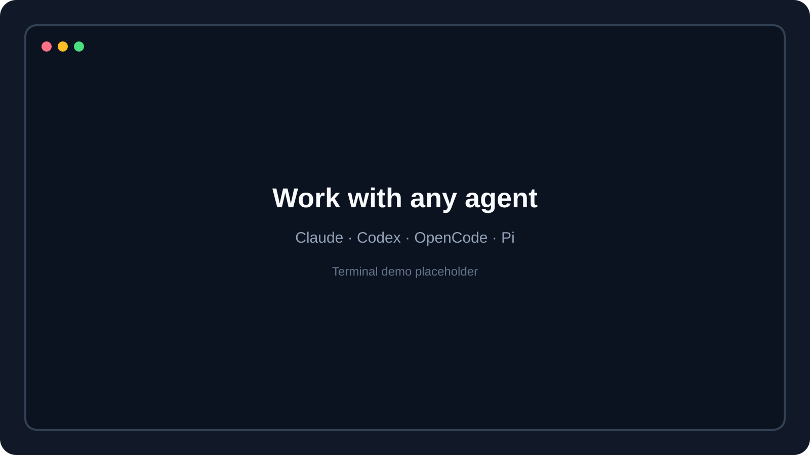

<p align="center">
  
</p>

<h3 align="center">
  Teach Pi what to remember, how to behave, and how to work with other agents.
</h3>

<p align="center">
  <a href="#work-with-other-agents">Work with other agents</a> &nbsp;·&nbsp;
  <a href="#install">Install</a> &nbsp;·&nbsp;
  <a href="#teach-pi-how-you-work">Teach Pi</a> &nbsp;·&nbsp;
  <a href="#scale-with-gitsense-chat">Scale with GitSense Chat</a> &nbsp;·&nbsp;
  <a href="#try-it-yourself">Try it yourself</a>
</p>

**pi-brains** helps [Pi](https://github.com/earendil-works/pi) remember what
matters, follow your rules, and work with other agents. It uses GitSense to
carry knowledge across conversations and gives each session a mailbox that any
agent with `gsc` can reach.

Keep working in your terminal. When you want help managing more sessions, add
[GitSense Chat](https://github.com/gitsense/chat) to organize them into Groups
with lead agents that keep track of progress and coordinate the work.

## Work with other agents

Give other agents a way to ask Pi what it knows or share something it should
know. Run `/brains inbox info` to show a session's mailbox address, then
share it with
Claude Code, Codex, OpenCode, or any agent that can run `gsc`.

Use `gsc ask` when you need an answer, or `gsc inform` to send an update
without waiting for a reply. For example, Codex could ask Pi about a
repository or share a finding from its latest code review. Your running Pi
session wakes to handle the message using its own context and tools.

<p align="center">
  
</p>

## Install

Requires **Node.js 22.19.0 or newer**, **Pi 0.81.1 or newer**, and the
[GitSense (`gsc`) CLI](https://github.com/gitsense/gsc-cli).

```bash
pi install npm:@gitsense/pi-brains
```

Start Pi in a workspace and run:

```text
/brains
```

If [GitSense (`gsc`)](https://github.com/gitsense/gsc-cli) is not installed, `/brains` will show install instructions.

## Teach Pi how you work

Notes and lessons give Pi reusable context, and rules guide how it behaves.
Teach it once, and later sessions start with your context instead of
rediscovering it:

1. **You teach:** Ask Pi to record useful findings, rules to follow, mistakes to avoid, or context to retrieve.
2. **It records:** Pi uses GitSense to save focused records in personal or repository scope, with file and topic associations where supported. Not every conversation is automatically turned into knowledge.
3. **It applies:** Agents retrieve relevant records, while pi-brains evaluates enabled rules at supported lifecycle events, such as before a tool call or after a tool result.

For example, ask Pi:

```text
Create a repository rule that blocks edits under src/auth/ until the agent
has read docs/security.md in the current session. Load the GitSense rule
authoring guides first, and show me how to test the rule.
```

Once authored and enabled, that rule can stop an edit before it happens and
explain what context is missing. Other rules can deliver relevant context,
remind Pi to verify a result, or run checks around tool actions.

pi-brains complements hooks, Markdown instructions, and search. Pi still
verifies important findings against source; it gets a better starting point
instead of having to rediscover every convention in each conversation.

### Configure rules

Pi Brains includes an opt-in [rule catalog](rules/README.md). Package
installation does not activate these policies automatically. Users can review
each bundle and import it into either personal scope for cross-repository
behavior or repository scope for project-shared behavior.

The first included pack guides supported shell discovery commands through
`gsc bash`, producing structured evidence that can be correlated with the Pi
session. It offers advisory and strict modes. See the
[observable shell discovery instructions](rules/gsc-bash-observability/README.md)
for review, installation, switching, and removal commands.

Start the interactive configuration from Pi:

```text
/brains rules shell
```

## Make work easier to pick up

A checkpoint captures what a session understands, the decisions it made, the
risks it sees, and its next steps. Run `/brains checkpoint` at a meaningful
boundary. Generation happens on a scratch conversation branch, so creating a
checkpoint does not clutter your main thread, and the extension verifies the
record was persisted before offering to return you to the original branch.

Ask for a checkpoint before you step away, then read it when you come back. A
lead or a future session can do the same: checkpoints answer what an agent is
working on and what it has already worked on without reading the whole
conversation transcript.

A checkpoint records what the agent reported understanding at that moment. It
is not proof that the work is correct or still current.

Checkpoints preserve understanding. When you also need the exact file contents
a session worked with, use `/brains snapshots create`; see the
[snapshot details](#session-snapshots) for coverage and exclusions.

## Scale with GitSense Chat

A session name does not always tell you enough. GitSense Chat helps you find
past work by what was discussed or which files were involved. Checkpoints
capture what each agent understood, decided, and planned next, so you or a
lead can catch up without reading the whole conversation.

As your sessions grow, you don't have to juggle them all yourself. Organize
related Pi sessions into Groups and add a lead agent that helps keep track of
progress, bring findings together, and coordinate the work. Tell a lead what
you need; it knows how to use GitSense to create agents, bring existing
sessions into a Group, and arrange them around your work. pi-brains provides
the messaging, checkpoints, and liveness information that make this possible.

<table width="100%">
  <tr>
    <td width="50%" valign="top">
      <p align="center"><strong>Organize your sessions</strong></p>
      <p align="center"></p>
    </td>
    <td width="50%" valign="top">
      <p align="center"><strong>Give agents a lead</strong></p>
      <p align="center"></p>
    </td>
  </tr>
  <tr>
    <td width="50%" valign="top">
      <p align="center"><strong>Monitor work at a glance</strong></p>
      <p align="center"></p>
    </td>
    <td width="50%" valign="top">
      <p align="center"><strong>Build knowledge teams</strong></p>
      <p align="center"></p>
    </td>
  </tr>
  <tr>
    <td width="50%" valign="top">
      <p align="center"><strong>Bring results together</strong></p>
      <p align="center"></p>
    </td>
    <td width="50%" valign="top">
      <p align="center"><strong>Turn reports into actions</strong></p>
      <p align="center"></p>
    </td>
  </tr>
</table>

Sessions running pi-brains report whether they are alive, so GitSense Chat can
show who is running, stopped, or ready to receive work without opening every
terminal. A fresh heartbeat means the session is alive, not that its work is
correct or complete. A missing or stale heartbeat means availability is
uncertain, not that the process stopped or that you may restart it. See the
[heartbeat details](docs/session-liveness.md) for implementation specifics.

Creating or starting agents requires your explicit direction. Executable
actions remain subject to application authorization and command validation.

Pi currently powers Chat's session and Group integration. Other harnesses can
access shared knowledge and consult Pi agents through `gsc`; this does not
imply integration of their session logs or lifecycle state.

**[See GitSense Chat demos and workflows →](https://github.com/gitsense/chat)**

## Try It Yourself

These repos are already set up so you can see how pi-brains works.

- **Rules demo:** [`gsc-rules-demos`](https://github.com/gitsense/gsc-rules-demos)
  shows how rules, notes, and lessons help Pi work with a repository.
- **Knowledge demo:** [`gitsense/pi`](https://github.com/gitsense/pi)
  shows how queryable repository knowledge helps Pi decide where to look
  before reading code.

Setup steps and full walkthroughs live in each repository's README.

## Essential commands

| Command | Description |
| --- | --- |
| `/brains` | Initialize Pi Brains |
| `/brains inbox` | Review messages from people and other agents |
| `/brains inbox info` | Show the mailbox address to share with other agents |
| `/brains inbox auto on` | Automatically accept human-originated Chat messages |
| `/brains role <description>` | Assign a worker role in a fresh session |
| `/brains sessions` | Open the GitSense Chat view for all Pi sessions |
| `/brains search` | Open GitSense Chat search across Pi sessions |
| `/brains checkpoint` | Record understanding, decisions, risks, and next steps |
| `/brains rules` | Show rule status and configuration options |

Run `/brains help` inside Pi to discover additional commands.

<details>
<summary>Additional command reference and snapshot details</summary>

### Additional commands

| Command | Description |
| --- | --- |
| `/brains` | Initialize GitSense expert context |
| `/brains build` | Build/import all local Brain manifests from `.gitsense/manifests` |
| `/brains build <brain-name>` | Build/import one local Brain manifest |
| `/brains build <manifest-path-or-url>` | Build/import a Brain from a path or URL |
| `/brains build --force` | Rebuild Brain manifests even if cached data exists |
| `/brains build help` | Show Brain build help and current Brain status |
| `/brains insights` | Show a static inspect snapshot |
| `/brains rules` | Show rule status and options |
| `/brains rules on` | Enable rules checking |
| `/brains rules off` | Disable rules checking |
| `/brains rules status` | Show recent rule decisions |
| `/brains rules shell` | Configure observable shell discovery rules |
| `/brains rules shell status` | Show personal and repository shell-rule modes |
| `/brains about` | Show what GitSense can do |
| `/brains debug` | Toggle debug logging |
| `/brains debug on` | Enable debug logging |
| `/brains debug off` | Disable debug logging |
| `/brains debug file` | Show the debug log file path |
| `/brains checkpoint` | Create a review checkpoint |
| `/brains checkpoint exit` | Return from the checkpoint branch |
| `/brains role <description>` | Assign a worker role in a fresh session |
| `/brains checkpoint suggest on` | Enable checkpoint suggestions |
| `/brains checkpoint suggest off` | Disable checkpoint suggestions |
| `/brains checkpoint suggest status` | Show checkpoint suggestion status |
| `/brains snapshots` | Show snapshot status for the current session |
| `/brains snapshots insights on` | Enable deterministic user-facing snapshot insights for this session |
| `/brains snapshots insights off` | Disable snapshot insights for this session |
| `/brains snapshots insights status` | Show whether snapshot insights are enabled for this session |
| `/brains snapshots review` | Review snapshot, mutation, and shell-coverage facts without creating a snapshot |
| `/brains snapshots list` | List each stage's directory, manifest, Git object database, and commit |
| `/brains snapshots create` | Capture the exact recognized file contents at the current session leaf |
| `/brains snapshots clear` | Move the current session's snapshots to a recoverable archive |
| `/brains forget` | Prune entries after the current `/tree` position (with backup) |
| `/brains summary` | Generate a session summary as the final message |
| `/brains inspect` | Show inspect view instructions |
| `/brains me` | Show and copy this agent's session ID, process ID, and inbox auto-accept status |
| `/brains inbox` | Review pending messages in the session inbox |
| `/brains inbox list` | List all messages in the session inbox |
| `/brains inbox info` | Show the mailbox address, message summary, and wait-group progress |
| `/brains inbox clear` | Dismiss rejected outbound sends |
| `/brains inbox code generate` | Generate a 90-day Chat inbox code and enable Chat sending |
| `/brains inbox code delete` | Revoke the Chat inbox code and disable Chat sending |
| `/brains inbox code status` | Show the current Chat inbox code status |
| `/brains inbox status` | Show the current auto-accept setting |
| `/brains inbox auto` | Show or configure automatic inbox acceptance |
| `/brains inbox auto on` | Automatically accept human-originated Chat messages |
| `/brains inbox auto off` | Disable automatic inbox acceptance |
| `/brains inbox auto status` | Show automatic inbox acceptance status |
| `/brains inbox help` | Show inbox commands and current settings |
| `/brains dismiss` | Dismiss the GitSense unavailable notice |
| `/brains help` | Show available commands |

### Session snapshots

Session snapshots preserve the exact contents of files recognized from session
activity, including files outside a Git repository. Run `/brains snapshots
create` before a broad change or after a verified milestone. If the recognized
file tree has not changed, GitSense reuses the latest stage instead of creating
a duplicate. Run `/brains snapshots list` to see the filesystem location of
every stage and manifest, plus the shared Git object database and commit IDs.

Snapshot insights are off by default and scoped to the current session. Enable
them with `/brains snapshots insights on`. Pi Brains then shows deterministic,
user-facing facts before the first direct mutation and warns once when shell
activity makes file coverage uncertain. It does not inject agent instructions
or create snapshots automatically. Run `/brains snapshots review` at any time
to inspect the current baseline, recognized direct-tool files, direct mutations
since the baseline, and shell-coverage status.

Snapshots may include recognized files outside the working repository. Common
credential paths and `.env`/private-key files are excluded. The defaults also
exclude files over 64 MiB and cap each stage at 256 MiB. `clear` asks for
confirmation and moves data under `GSC_HOME/data/pi/snapshot-trash` rather than
deleting it immediately.

</details>

## Current Boundaries

- File tracking is exact for structured `read`, `edit`, and `write` tools.
- Arbitrary shell file activity may be missing.
- Brain analysis and cross-session history require GitSense integration.
- Brains are guidance, not a replacement for source verification.
- Liveness is advertised by the extension heartbeat store; a Pi session without pi-brains loaded writes no heartbeat.

## Development

```bash
npm install
npm run check
npm test

# Regenerate portable observable-shell rule bundles after editing their triggers
npm run rules:build
```

To try local changes in Pi, install this package from your checkout:

```bash
pi install /path/to/pi-brains
pi
```

Then run:

```text
/brains
```

## License

Licensed under the [Apache License 2.0](LICENSE). See [NOTICE](NOTICE) for
attribution notices.
